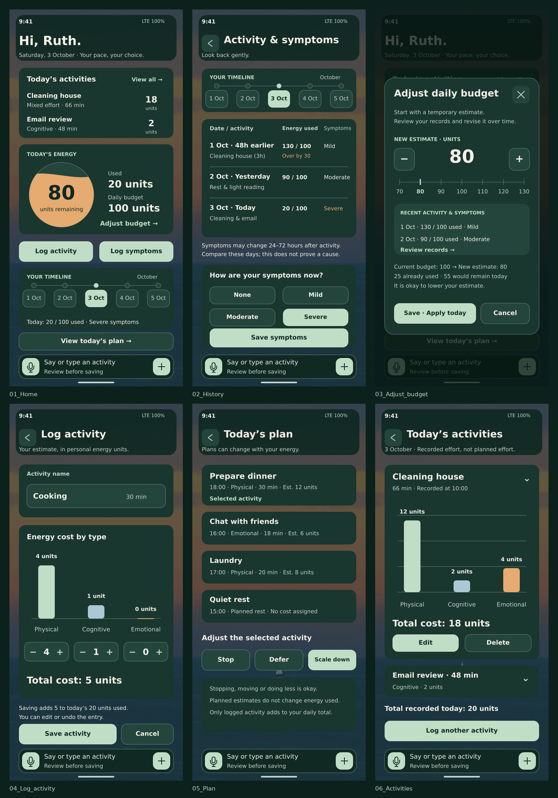

# 最新版：Ruth · 背景、时间轴和语音恢复版

保留原稿的六个核心页面、水波精力圆、三类消耗柱图和活动列表；恢复原日落／海面背景、时间轴和语音输入，首页加入Hi, Ruth。统一深绿卡片、浅绿按钮和字体，并补充语音确认、计划调整和保存结果，共16个界面／状态。

## 查看／下载本次版本

- [六个核心页总览](ruth-restored/Six_Core_Screens.png)
- [全部16个界面](ruth-restored/All_Screens.png)
- [首页原稿与恢复版对照](ruth-restored/Home_Before_After.png)
- [下载SVG导入包](ruth-restored/Ruth_Figma_Import.zip)
- [16页PDF预览](ruth-restored/Ruth_Prototype_Preview.pdf)
- [导入说明、需求映射与检查结果](ruth-restored/README.md)

打开ZIP文件后点击Download raw file下载。将包里的screens导入Figma，各自建立440×956 Frame，再从Figma导出最终PDF。预览文件由本地工具生成；这是非交互界面原型，没有实现实际录音或保存。

## 怎么删除GitHub里的旧文档

打开想删的文件 → 文件右上角…（或编辑按钮旁下拉菜单）→ Delete file → Commit changes，提交到main。删除本地文件不会自动删除GitHub文件。

旧版目录revised、original-touchup、original-unified仍保留；本次最新版是ruth-restored。没有自动删除用户尚未指定删除的内容。
