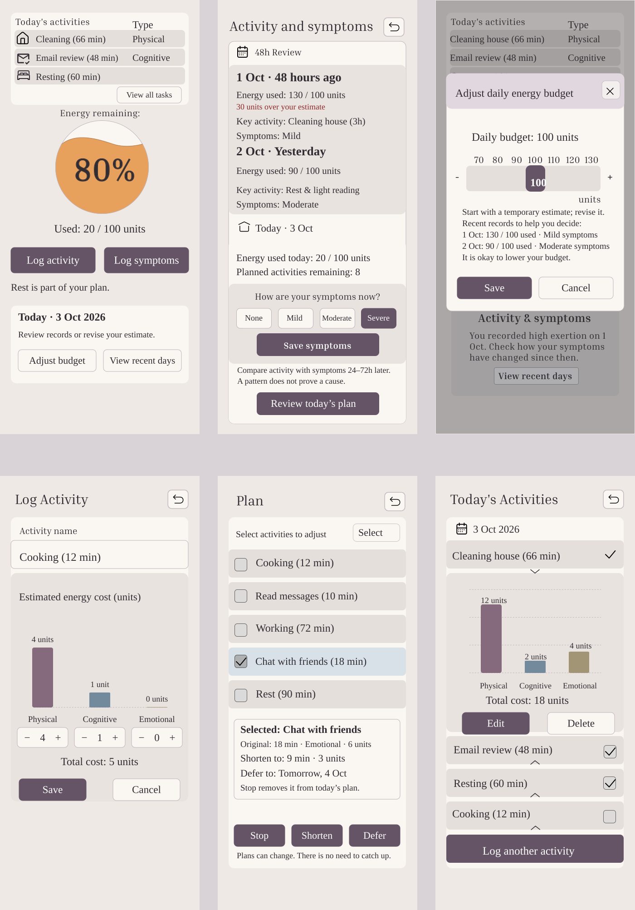

# 最新版本：在用户原稿基础上统一风格

保留原来的六个页面及其主要结构，统一按钮、卡片、颜色、字体和间距；删除照片背景、无标签工具栏、语音条、不清楚的时间尺和重复占位活动。

- [查看当前六页效果](original-unified/After.png)
- [查看原稿与当前版本对照](original-unified/Before_After.png)
- [下载当前 SVG 修改包](original-unified/Unified_Original_Layout.zip)
- [六页 PDF 预览](original-unified/Unified_Original_Preview.pdf)
- [修改清单与 Figma 导入说明](original-unified/README.md)

在 Figma 新建 Page，导入包中的 screens 文件夹内六个 SVG，各自建立440×956 Frame，然后从 Figma 导出最终 PDF。

以前版本保留在 revised 和 original-touchup 文件夹中，不作为这次交付。
