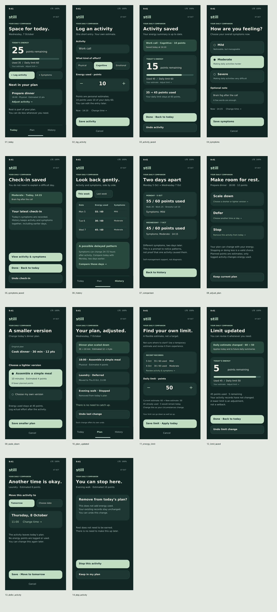
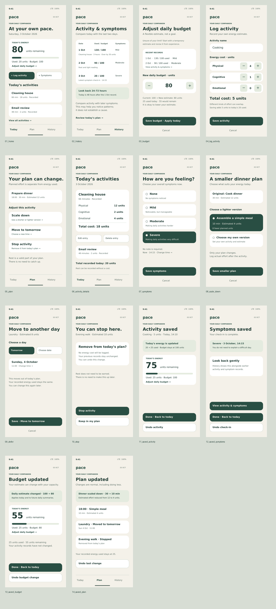

# Still — Energy at your pace

高保真、非交互的手机 App 设计，用于帮助慢性疲劳用户记录活动、观察症状和调整精力计划。

## 下载设计

- [完整 Figma 导入包](Still_Figma_Import.zip)：14 个 SVG 界面、PDF 预览及导入说明。
- [PDF 预览](Still_Prototype_Preview.pdf)
- [Figma 导入步骤与作业要求核对](README_交付说明.md)
- [全部 SVG 界面](screens)

打开文件后，使用 GitHub 的 Download raw file 按钮下载；也可使用仓库 Code → Download ZIP 下载全部文件。

**此处 PDF 是本地生成的预览，并非 Figma 导出文件。**按课程要求，需将 SVG 导入 Figma，建立 390 × 844 的 Frame，再从 Figma 导出最终 PDF。尚未创建原生 Figma 文件或提交到 Canvas。

本设计依据用户提供的作业整理文本制作；没有原始课程手册可供核对。可用性检查、数据说明和需求映射见交付说明。

## 用户原稿修改版

[查看新版设计及导入说明](revised/README.md) · [下载新版 SVG 设计包](revised/Revised_Figma_Import.zip)

